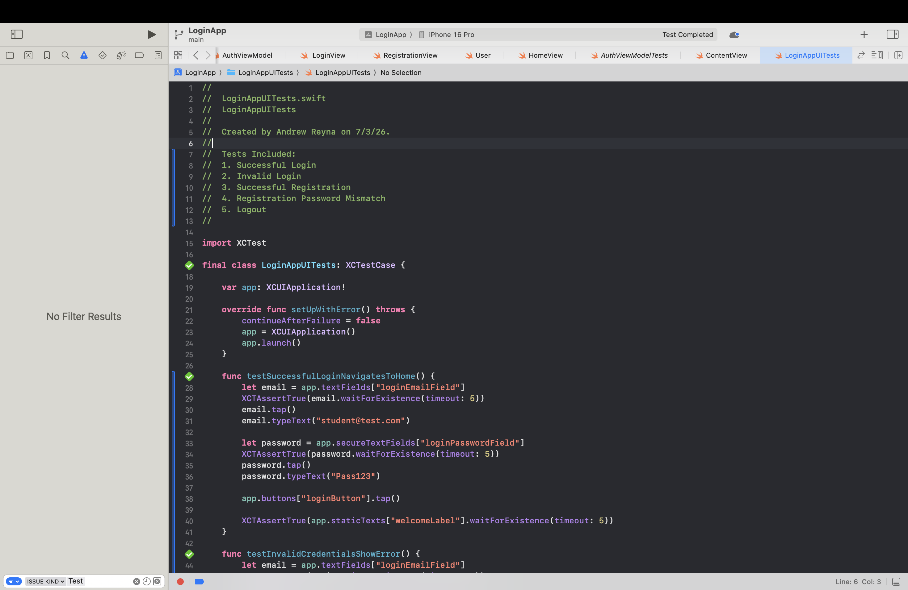
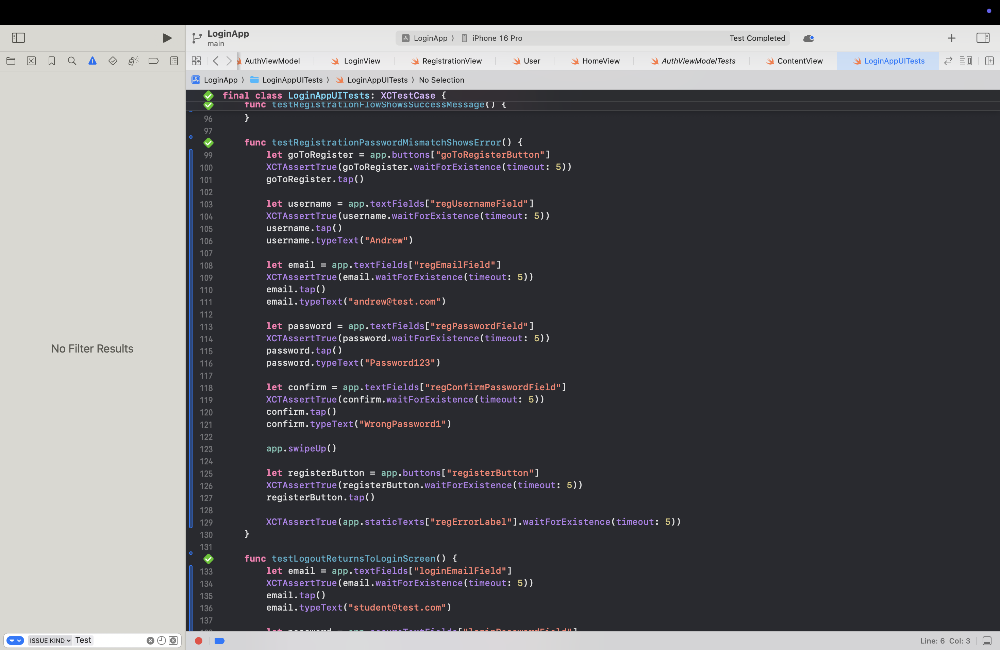
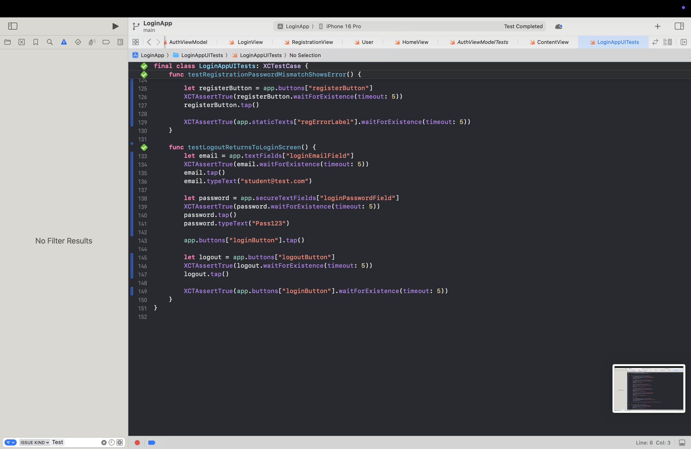

# LoginApp
# LoginApp

A SwiftUI Login & Registration application built using the MVVM architecture. This project demonstrates user authentication, validation logic, Unit Testing, and UI Testing using XCTest.

---

## Features

- Login screen
- Registration screen
- Home screen
- Email validation
- Password validation
- Confirm password validation
- Error messages for invalid input
- Successful login navigation
- Welcome screen displaying the logged-in user
- Unit Tests using XCTest
- UI Tests using Xcode UI Testing

---

## Technologies Used

- Swift
- SwiftUI
- MVVM Architecture
- XCTest
- Xcode

---

## Project Structure

LoginApp/
- LoginView.swift
- RegistrationView.swift
- HomeView.swift
- AuthViewModel.swift
- User.swift

LoginAppTests/
- AuthViewModelTests.swift

LoginAppUITests/
- LoginAppUITests.swift

---

## Screenshots

### Unit Test 1

### Unit Test 2

### Unit Test 3

### Unit Test 4

### Demo 1

### Demo 2

### Demo 3

---

## Validation Rules

### Email
- Cannot be empty
- Must contain '@'
- Must contain a valid domain

### Password
- Minimum 6 characters
- Must contain at least one number

### Registration
- Username required
- Email required
- Password required
- Confirm password must match

---

## Unit Tests

The project includes tests for:

- Email validation
- Password validation
- Empty login fields
- Password mismatch
- Successful login

---

## UI Tests

Automated UI tests include:

- Successful login flow
- Invalid login error handling
- Successful registration flow
- Password mismatch validation
- Logout flow

---

## How to Run

1. Clone the repository.
2. Open `LoginApp.xcodeproj` in Xcode.
3. Select an iPhone simulator.
4. Press **⌘R** to run the application.
5. Press **⌘U** to execute all Unit Tests and UI Tests.

---

## Future Improvements

- Persistent user storage using SwiftData or Core Data
- Password hashing
- Remember Me functionality
- Dark Mode customization
- Firebase Authentication
- Password reset functionality

---

## Author

Andrew Reyna

SDGKU

SwiftUI Login & Registration Final Project
